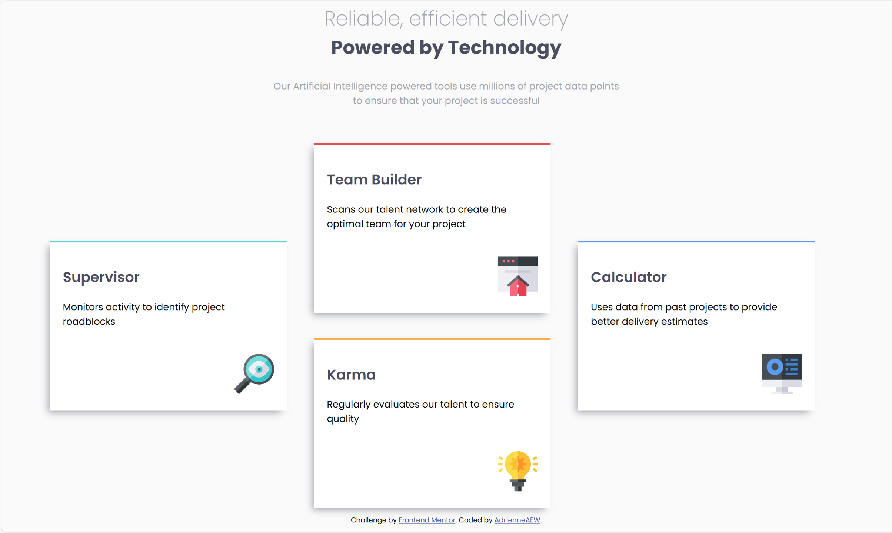

# Frontend Mentor - Four card feature section solution

This is a solution to the [Four card feature section challenge on Frontend Mentor](https://www.frontendmentor.io/challenges/four-card-feature-section-weK1eFYK). Frontend Mentor challenges help you improve your coding skills by building realistic projects. 

## Table of contents

- [Overview](#overview)
  - [The challenge](#the-challenge)
  - [Screenshot](#screenshot)
  - [Links](#links)
- [My process](#my-process)
  - [Built with](#built-with)
  - [What I learned](#what-i-learned)
  - [Continued development](#continued-development)
  - [Useful resources](#useful-resources)
- [Author](#author)
- [Acknowledgments](#acknowledgments)

**Note: Delete this note and update the table of contents based on what sections you keep.**

## Overview
Build out a feature section that looks as close to the design as possible. 

This challenge was completed without the priviledge of design specs. 

### The challenge

Users should be able to:

View the optimal layout for the site depending on their device's screen size.

### Screenshot

### Links

- Solution URL: [Add solution URL here](https://github.com/AdrienneAEW/four-card-feature-section)
- Live Site URL: [Add live site URL here](https://github.com/AdrienneAEW/four-card-feature-section/deployments/github-pages)

## My process
There are two powerful CSS frameworks that provide endless possibilities for layouts across a variety of device sizes. These frameworks are Grid and Flexbox. The most significant difference between the two - Grid is two dimensional utilzing both rows and columns to building layouts. While Flexbox is one dimensional utilizin either rows or columns.  For practice I've used these Newbie challenges to test for best use when deploying either Grid or Flexbox. This project uses Grid as there was a need to control both dimensions without writing tons of code. It also made the transitioning between device sizes seamless.

### Built with

- Semantic HTML5 markup
- SCSS custom properties
- CSS Grid

### What I learned

In most cases either Grid or Flexbox are tools that do have best practice usuage. Cards are more efficient, easy to transit and maintain design consistency with the Grid framework.

### Continued development

There are tons of new CSS properties to use in conjuction with both framworks, but I would like to start using the two frameworks together. After all page layouts consist of secitons and each section dictates which (if any) framework should be use solo or conjunctions. It's a good thing.

### Useful resources

- [A Freecode Camp Blog Post](https://www.freecodecamp.org/news/flexbox-vs-grid-in-css/) - A wonderfully written, easy to digest article that dives into Grid and Flexbox.
- [A Refine Post](https://refine.dev/blog/css-grid-vs-flexbox/#introduction) - A comparison of each framework that includes use cases and performance considerations.

## Author

- Website - [AdrienneAEW](https://adrienneaew.me)
- Frontend Mentor - [@yAdrienneAEW](https://www.frontendmentor.io/profile/AdrienneAEW)

